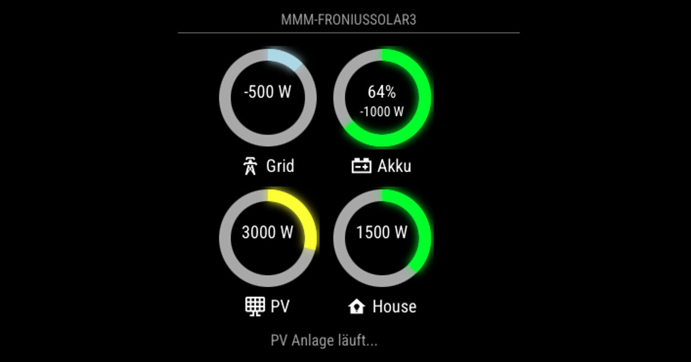
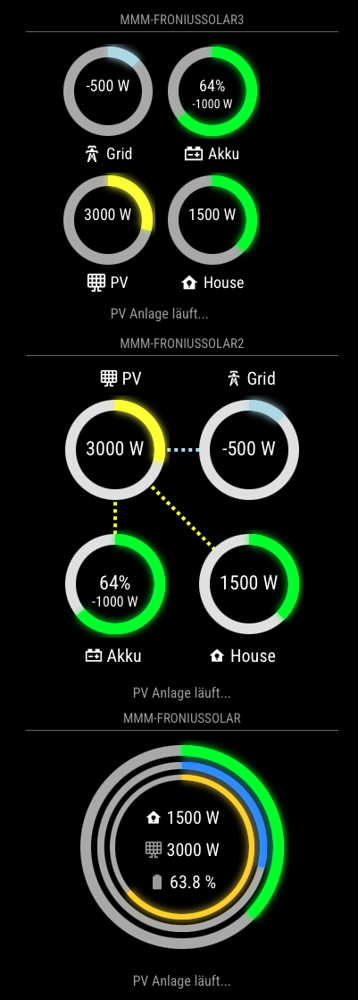

# MMM-FroniusSolar3

Third module of the `MMM-FroniusSolar`-family (see below).

The `MMM-FroniusSolar3` module is designed for the [MagicMirror²](https://magicmirror.builders/) platform to visualize solar energy data from a Fronius solar system. It features a responsive and dynamic layout with grid-like arrangements and flexible sizing options, making it suitable for modern and adaptive displays.

## Features
- **Dynamic Gauges**: Displays real-time data for:
  - `P_Akku` (Battery Power)
  - `P_Grid` (Grid Power)
  - `P_Load` (House Load)
  - `P_PV` (Solar Panel Power)
- **Responsive Design**: Supports dynamic width (`var(--dynamic-width)`) and flex-wrap for adaptable layouts.
- **Customizable Styling**: Allows configuration of SVG gauge sizes, grid arrangements, and text styling.


## Screenshot



---

## Installation
1. Clone the repository into your MagicMirror/modules directory:
   
```bash
   cd ~/MagicMirror/modules
   git clone https://github.com/ChrisF1976/MMM-FroniusSolar3.git
```
   
2. Install dependencies:
```bash
cd MMM-FroniusSolar3
npm install
```


## Configuration
Add the module to the `config.js` file:

```bash
{
    module: "MMM-FroniusSolar3",
    position: "bottom_right", //select the best region for your module
    header: "MMM-FroniusSolar3",
    config: {
        updateInterval: 5*1000, // Update interval in milliseconds
        width: "300px", // Dynamic width for grid layout.
        icons: {
            P_Akku: "mdi:car-battery",
            P_Grid: "mdi:transmission-tower",
            P_Load: "mdi:home-lightbulb",
            P_PV: "mdi:solar-panel-large"
        },
        Radius: 50, // Radius for the SVG gauge
        MaxPower: 4000, // Maximum power for Grid scaling
        MaxPowerPV: 10400, // Maximum power for PV scaling
        ShowText: true,
        TextMessge: [
            { about: "600", Text: "Leicht erhöhter Netzbezug.", color: "#999" },
            { about: "1000", Text: "Über 1 KW Netzbezug!", color: "#ffffff" },
            { about: "1500", Text: "Über 1,5KW Netzbezug.", color: "#eea205" },
            { about: "2500", Text: "Über 2,5KW aus dem Netz!", color: "#ec7c25" },
            { about: "5000", Text: "Auto lädt, richtig? Nächstes Mal auf Sonne warten.", color: "#cc0605" },
            { less: "-500", Text: "Sonne scheint! Mehr als 500W frei.", color: "#f8f32b" },
            { less: "-2000", Text: "Wäsche waschen! Über 2KW freie Energie!", color: "#00bb2d" },
            { less: "-4000", Text: "Auto laden! Über 4KW freie Energie!", color: "#f80000" },
        ],
    },
},
```

### Configuration Options

| **Option**        | **Default**       | **Description**                                                                   |
|-------------------|-------------------|-----------------------------------------------------------------------------------|
| `updateInterval`  | `5*1000` (5 sec)  | Time interval (in milliseconds) between data updates from the Fronius system.     |
| `width`           | `300px`           | Hints: <100px - vertical layout; 300px - game dice 4 layout; >480px - horizontal  |
| `icons`           | N/A               | Define custom Icons for power flow elements - [Iconify](https://iconify.design)   |
| `Radius`          | `120`             | Radius of the SVG gauges (in pixels).                                             |
| `MaxPower`        | `4000`            | Maximum power value for scaling P_Grid and P_Load gauges.                         |
| `MaxPowerPV`      | `10400`           | Maximum power value for scaling P_PV (solar panel power).                         |
| `ShowText`        | `true`            | Enable or disable dynamic text messages below the gauges.                         |
| `TextMessge`      | `[]`              | Array of objects defining conditional text messages based on P_Grid values.       |

#### Text Message Format

| **Key**   | **Description**                                                     |
|-----------|---------------------------------------------------------------------|
| `about`   | Display the message when P_Grid exceeds this value.                 |
| `less`    | Display the message when P_Grid is below this value.                |
| `Text`    | The message to display.                                             |
| `color`   | Color of the message text (hex or CSS color names).                 |


## How It Works

### Data Retrieval
- Fetches real-time data from the Fronius system using the `node_helper.js` backend.

### Visualization
- Gauges are created using SVG, displaying current values and percentages.

### Dynamic Messages
- Displays context-sensitive messages based on `P_Grid` values.

## Styling

Custom styles can be adjusted in the `MMM-FroniusSolar3.css` file.

### House Gauge Color Logic

| **Condition**                        | **Color**    | **Description**                                                                                         |
|--------------------------------------|--------------|---------------------------------------------------------------------------------------------------------|
| `P_Akku - 100 > abs(P_Grid)`         | `#a3c49f`    | **Light green**: High battery activity is contributing significantly to the house's energy consumption. |
| `P_Grid > 150`                       | `#808080`    | **Gray**: High grid consumption is being used to power the house.                                       |
| `outerPower > 0`                     | `#00ff00`    | **Green**: Positive power flow (house is self-sufficient or partially consuming generated energy).      |
| `outerPower < 0`                     | `#add8e6`    | **Light blue**: Energy is being exported to the grid (surplus power).                                   |


## Dependencies

- [MagicMirror²](https://magicmirror.builders/)
- Fronius Symo GEN24 with activated SolarApi.

---

## Common Features of MMM-FroniusSolar(X)

All three modules, [MMM-FroniusSolar](https://github.com/ChrisF1976/MMM-FroniusSolar), [MMM-FroniusSolar2](https://github.com/ChrisF1976/MMM-FroniusSolar2), and [MMM-FroniusSolar3](https://github.com/ChrisF1976/MMM-FroniusSolar3), are designed to display solar energy data. They share several configurations and CSS properties:

- **Configuration Settings**: Each module displays metrics such as `P_Akku`, `P_Grid`, `P_Load`, and `P_PV` using configurable icons and messages.
- **Dynamic SVG Gauges**: All modules include gauges to represent power flow visually.
- **Text Messages**: Each module uses conditional text messages based on `P_Grid` values.



## Recommended Use Cases

- **[MMM-FroniusSolar](https://github.com/ChrisF1976/MMM-FroniusSolar)**: Best for simple setups prioritizing clarity and minimalism.
- **[MMM-FroniusSolar2](https://github.com/ChrisF1976/MMM-FroniusSolar2)**: Suitable for scenarios requiring visual feedback on power flows (e.g., monitoring dynamic energy consumption).
- **[MMM-FroniusSolar3](https://github.com/ChrisF1976/MMM-FroniusSolar3)**: Ideal for larger or customizable displays where scalability and enhanced readability are critical.

## Key Differences

### 1. CSS Styling

#### MMM-FroniusSolar
- Focuses on a clean layout.
- compact, centralized look.
- Basic visual structure, with no animations or flow effects.
- [MMM-FroniusSolar](https://github.com/ChrisF1976/MMM-FroniusSolar)

#### MMM-FroniusSolar2
- Introduces **animation effects** for flow lines (stroke-dasharray and @keyframes for dashed animations), enhancing visual dynamics.
- The layout (.solar2-wrapper) still focuses on central alignment but supports SVG animations for a more interactive appearance.
- Text elements are compact but extend slightly wider, accommodating messages better.
- [MMM-FroniusSolar2](https://github.com/ChrisF1976/MMM-FroniusSolar)

#### MMM-FroniusSolar3
- Uses a **dynamic width** (width: var(--dynamic-width)), allowing for greater flexibility in module resizing.
- The .solar3-wrapper employs flex-wrap: wrap and a gap, enabling a grid-like arrangement for gauges.
- Text labels and icons (.gauge3-label) are styled for improved readability and differentiation.
- [MMM-FroniusSolar3](https://github.com/ChrisF1976/MMM-FroniusSolar)

### 2. Functional Enhancements

- **[MMM-FroniusSolar](https://github.com/ChrisF1976/MMM-FroniusSolar)**: Simpler functionality with standard gauge rendering.
- **[MMM-FroniusSolar2](https://github.com/ChrisF1976/MMM-FroniusSolar2)**: Adds animation, making it visually engaging for displaying dynamic power changes.
- **[MMM-FroniusSolar3](https://github.com/ChrisF1976/MMM-FroniusSolar3)**: Focuses on adaptability with dynamic sizing and layout adjustments.

---

## License

This module is distributed under the [MIT License](LICENSE). See LICENSE for more details.